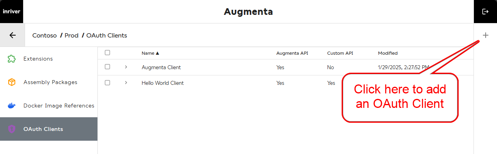
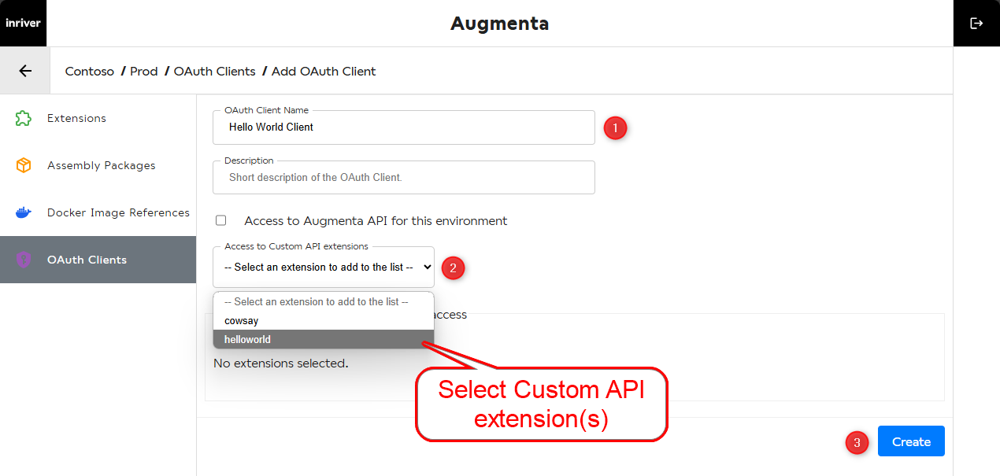
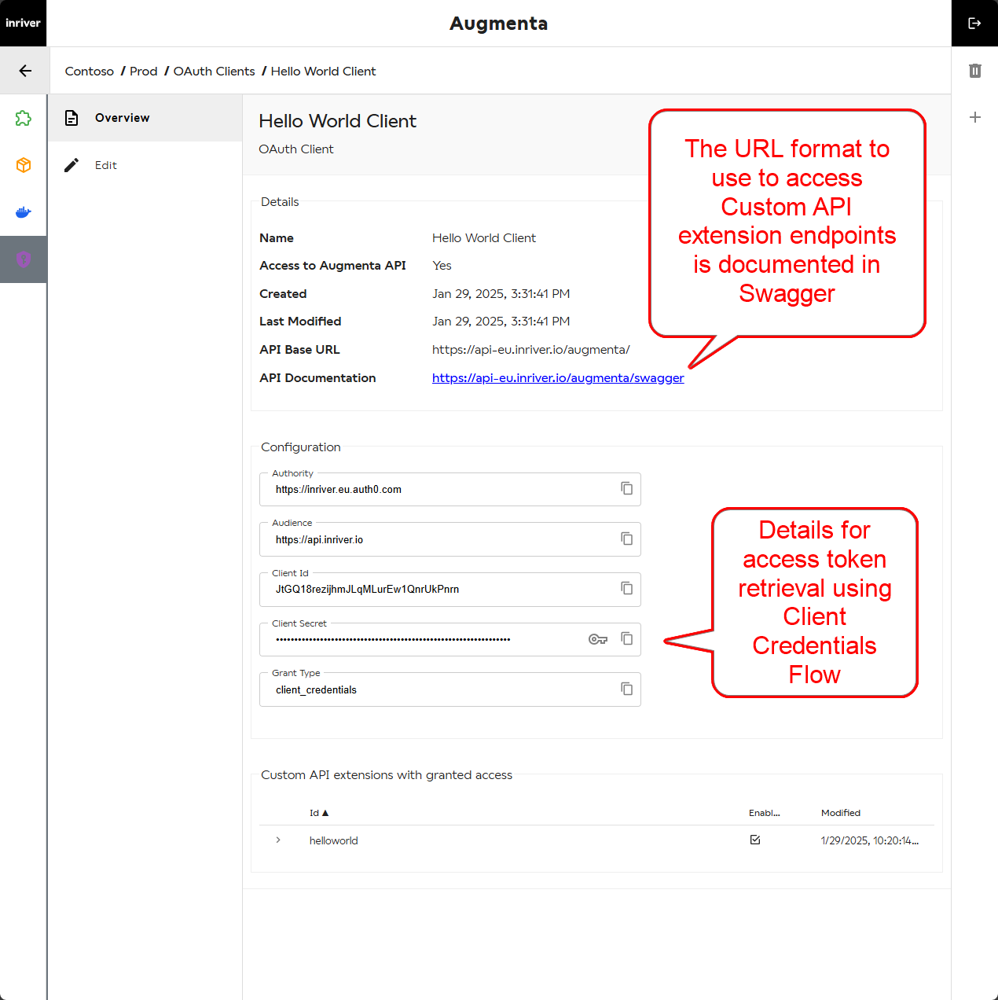
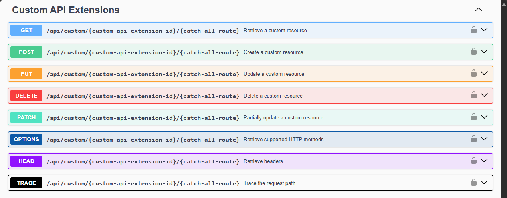

# Develop a Custom API extension in .NET

## Prerequisites

This is a continuation of [develop an extension in .NET with health and test endpoints](develop-dotnet-extension.md).

## Overview

The Custom API extension type enables developers to build and host APIs within inriver’s infrastructure, offering a flexible and secure way to process, transform, and integrate data.

This extension type can give you a lot of flexibility in how you can use the platform. For example, you could use a Custom API to transform data, import data into inriver, or even cover advanced querying scenarios like creating your own GraphQL APIs and just like with all other extension types in any language of your choice. By the end of this tutorial, you will understand how it works and what it could be used for in the future.

## Contents

This tutorial covers:

1. The example source code of a Custom API extension to explain how it works and its similarities with other extension types in Augmenta.
2. How to create OAuth clients using the UI to obtain a token for accessing Custom APIs.
3. The example on how to use Postman to retrieve the access token and interact with these APIs.

### Source Code

Here’s a simple example of a Custom API extension. It includes three standard endpoints for health checks and test checks, along with a custom endpoint `/api/hello`. The process to create it is identical to developing a simple extension, as covered in the prerequisite tutorial.

```csharp
var builder = WebApplication.CreateBuilder(args);
var app = builder.Build();

app.MapGet("/health/ready", () => "Healthy and Ready.");

app.MapGet("/health/live", () => "Healthy and Live");

app.MapGet("/api/test", () => $"Test is working. Current time is {DateTime.Now:O}");

app.MapGet("/api/hello", () => $"Hello World!"); // Custom Endpoint Added

app.Run();
```

### OAuth Clients

Custom APIs require a mechanism to manage access. OAuth Clients provide this functionality by granting controlled access. Below is the process for creating an OAuth client, subsequently stored in Auth0, which serves as the identity provider.





An advantage of this setup is that these clients can access both Custom APIs and standard Augmenta API (for CI/CD or local development), depending on your needs. For more general OAuth Client documentation and how to access Augmenta API, see [OAuth Client Management](../oauth-client/oauth-client-management.md).



The Augmenta API Swagger documents the URL format required to access Custom API endpoints. Augmenta acts as a proxy, authenticating and authorizing all requests.



In this example, the URL to use would be `/api/custom/helloworld/api/hello/`, where the last segment `/api/hello/` is a catch-all route forwarded by the proxy to the Custom API.

### Access Token Retrieval and Interacting with the Custom API

OAuth is a standard protocol, meaning you can use any programming language with HTTP support to request a token, given the necessary configuration variables.

For simplicity, we use Postman and JavaScript within Postman’s scripting environment to demonstrate the process [in this example.](../oauth-client/oauth-client-postman-example-custom-api.md)

### Summary

#### ✔ Flexibility

- Can handle anything from data transformation to two-way integration with external systems.

#### ✔ Performance

- Runs directly within inriver’s infrastructure, reducing latency and avoiding external data transfer costs.

#### ✔ Security

- Uses OAuth for secure access control.

#### ✔ Ease of Implementation

- Works similarly to other extension types, making it easy to adopt.
