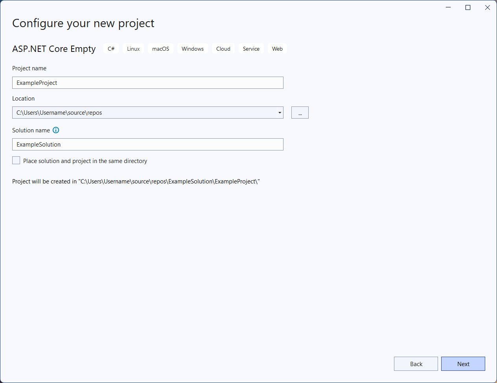
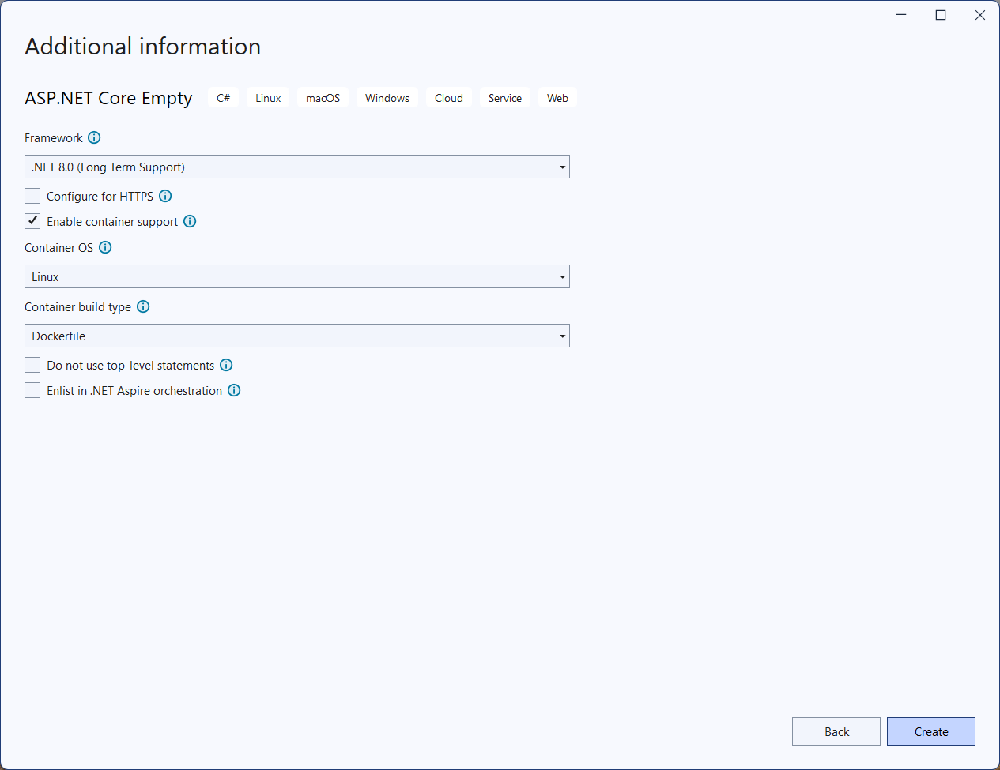
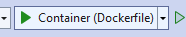
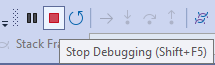
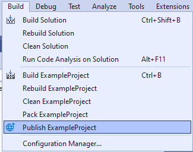
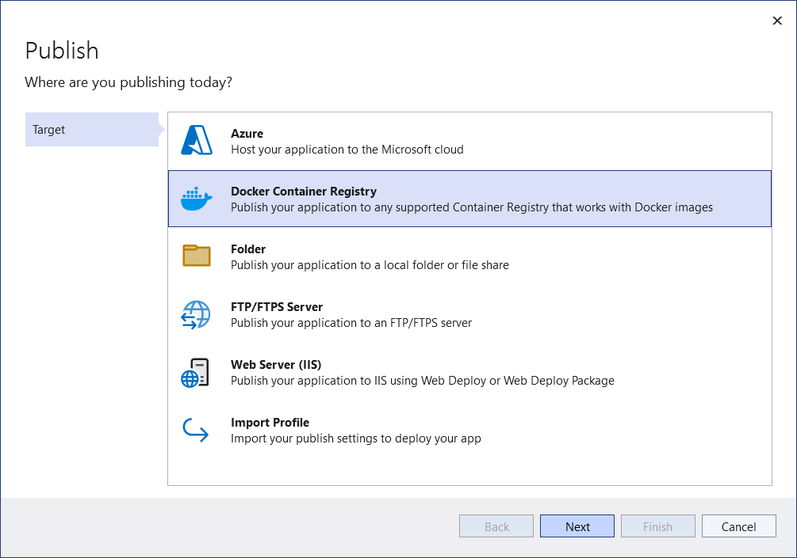
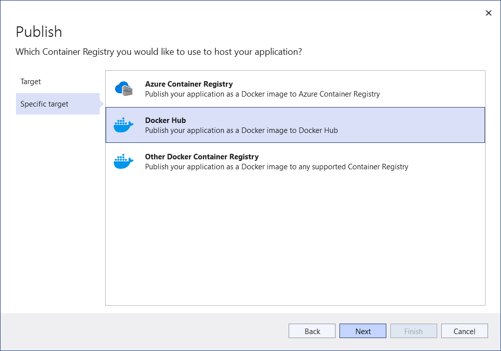
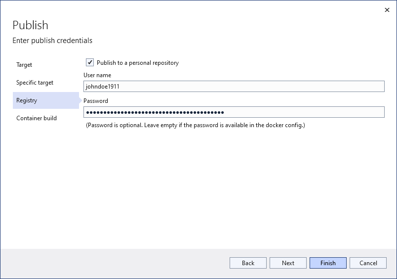
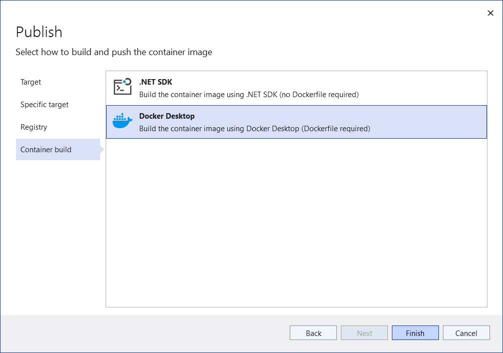
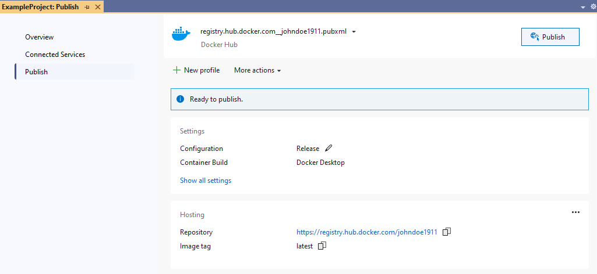

# Develop an extension in .NET using Visual Studio 2022

## Prerequisites

Make sure you have the following installed:

* [.NET 8.0 SDK](https://dotnet.microsoft.com/en-us/download/dotnet/8.0)
* [Docker desktop](https://www.docker.com/products/docker-desktop/)
* Visual Studio 2022 with web "module"

## Steps

### Create a new ASP.NET Core project

* Open Visual Studio 2022

* Select **Create a new project**, and select `ASP .NET Core Empty` template.

  

  Name the project `ExampleProject`, Uncheck the `Place solution and project in the same directory` and name the solution `ExampleSolution`

  

  Choose `.Net 8` as the framework, Uncheck `Configure for HTTPS`. Select `Enable container support` and specify `Linux` as Container OS, and `Dockerfile` as Container build type.
  Complete the project setup.

  

### Update Docker support

Open the **Dockerfile** and make the following changes:

* Replace `FROM mcr.microsoft.com/dotnet/aspnet:8.0 AS base` with  
  `FROM mcr.microsoft.com/dotnet/aspnet:8.0-alpine-amd64 AS base`  
  since Augmenta runs on the amd64 architecture, and alpine images are lightweight.

* Replace `EXPOSE 8080` with
  `EXPOSE 5005`
  since Augmenta extensions listen on 5005.

* Replace `FROM mcr.microsoft.com/dotnet/sdk:8.0 AS build` with
  `FROM mcr.microsoft.com/dotnet/sdk:8.0-alpine-amd64 AS build`
  since Augmenta runs on the amd64 architecture, and alpine images are lightweight.

The resulting **Dockerfile** looks like this:

```Docker
# See https://aka.ms/customizecontainer to learn how to customize your debug container and how Visual Studio uses this Dockerfile to build your images for faster debugging.

# This stage is used when running from VS in fast mode (Default for Debug configuration)
FROM mcr.microsoft.com/dotnet/aspnet:8.0-alpine-amd64 AS base
USER app
WORKDIR /app
EXPOSE 5005


# This stage is used to build the service project
FROM mcr.microsoft.com/dotnet/sdk:8.0-alpine-amd64 AS build
ARG BUILD_CONFIGURATION=Release
WORKDIR /src
COPY ["ExampleProject/ExampleProject.csproj", "ExampleProject/"]
RUN dotnet restore "./ExampleProject/ExampleProject.csproj"
COPY . .
WORKDIR "/src/ExampleProject"
RUN dotnet build "./ExampleProject.csproj" -c $BUILD_CONFIGURATION -o /app/build

# This stage is used to publish the service project to be copied to the final stage
FROM build AS publish
ARG BUILD_CONFIGURATION=Release
RUN dotnet publish "./ExampleProject.csproj" -c $BUILD_CONFIGURATION -o /app/publish /p:UseAppHost=false

# This stage is used in production or when running from VS in regular mode (Default when not using the Debug configuration)
FROM base AS final
WORKDIR /app
COPY --from=publish /app/publish .
ENTRYPOINT ["dotnet", "ExampleProject.dll"]
```

### Create a Minimal REST API

* Open **Program.cs**. You'll find the following code by default:

    ```csharp
    var builder = WebApplication.CreateBuilder(args);
    var app = builder.Build();

    app.MapGet("/", () => "Hello World!");

    app.Run();
    ```

    **Remove the "Hello World!" line**, as it’s not needed.

* **Add health endpoints:** These will be checked by inriver. When they return a 200 status code, the extension is considered healthy. Before `app.Run();` add the following:

    ```csharp
    app.MapGet("/health/ready", () => "Healthy and Ready.");

    app.MapGet("/health/live", () => "Healthy and Live");
    ```

* **Add the test endpoint:** This endpoint is available for all extensions and provides an easy way to test your extension once it's running. Before `app.Run();` add the following:

    ```csharp
    app.MapGet("/api/test", () => $"Test is working. Current time is {DateTime.Now:O}");
    ```

The resulting **Program.cs** looks like this:

```csharp
var builder = WebApplication.CreateBuilder(args);
var app = builder.Build();

app.MapGet("/health/ready", () => "Healthy and Ready.");

app.MapGet("/health/live", () => "Healthy and Live");

app.MapGet("/api/test", () => $"Test is working. Current time is {DateTime.Now:O}");

app.Run();
```

### Run the container locally from Visual Studio

Open **Properties\launchSettings.json** and replace its content with the following:

```json
{
  "profiles": {
    "Container (Dockerfile)": {
    "commandName": "Docker",
    "launchBrowser": true,
    "launchUrl": "{Scheme}://{ServiceHost}:{ServicePort}/api/test",
    "environmentVariables": {
      "ASPNETCORE_URLS": "http://*:5005"
    },
    "httpPort": 5005
    }
  },
  "$schema": "http://json.schemastore.org/launchsettings.json"
}
```

> **Note:**  
> The `ASPNETCORE_URLS` tells AspNet Core to listen to port 5005.
>
> The `httpPort` exposes port 5005 on localhost so that you can browse to that port.

Save the file, build the project, and run it.



The browser will open at `/api/test`, displaying **'Test is working. Current time is...**.


Congratulations. Your first extension is now running locally.

Stop Debugging.



### Specify name of the image

Modify the **ExampleProject.csproj** to include this line under a `<PropertyGroup>`:

```xml
<DockerfileTag>my-example</DockerfileTag>
```

The PropertyGroup will look like this:

```xml
  <PropertyGroup>
    <TargetFramework>net8.0</TargetFramework>
    <Nullable>enable</Nullable>
    <ImplicitUsings>enable</ImplicitUsings>
    <DockerDefaultTargetOS>Linux</DockerDefaultTargetOS>
    <DockerfileTag>my-example</DockerfileTag>
  </PropertyGroup>
```

### Create a container registry

If you do not already have a container registry setup, follow [Setup a container registry in the cloud](../setup-a-container-registry-in-the-cloud.md).

### Create a publish profile

In visual studio select **Build -> Publish ExampleProject**



Select **Docker Container Registry**



Select **Docker Hub**



Enter your credentials with your username and use your personal access token as the password.



For the container build, specify Docker Desktop.



### Build and publish the Docker image

> **Note:**  
> The name of the image will be the name of the repository in docker hub.
>
> The repository in **Docker Hub** will be **public** (not private) when you publish the image since it will create a new repository.

Publish the docker image.



This will build the image locally and push it to the container registry.

### Next steps

Proceed to [Run the extension in Augmenta](../run-extension-in-augmenta.md)
