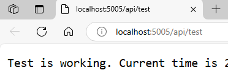

# Develop an extension in .NET

## Prerequisites

Make sure you have the following installed:

* [.NET 8.0 SDK](https://dotnet.microsoft.com/en-us/download/dotnet/8.0)
* [Docker desktop](https://www.docker.com/products/docker-desktop/)
* A code editor of your choice
* A working folder for your project (for example: `augmenta-test`)

## Steps

### Create a new ASP.NET Core project

Open your terminal, create the working folder if you haven’t already, and navigate into it. Then, run the following command to create a new ASP.NET Core project in a subdirectory named `ExampleProject`:

```sh
dotnet new web -n ExampleProject
```

### Add Docker support

Navigate to the **ExampleProject** folder:

```sh
cd ExampleProject
```

Create a new file named **Dockerfile** (without an extension) and add the following content:

```docker
FROM mcr.microsoft.com/dotnet/aspnet:8.0-alpine-amd64 AS base
USER app
WORKDIR /app
EXPOSE 5005

FROM mcr.microsoft.com/dotnet/sdk:8.0-alpine-amd64 AS build
ARG BUILD_CONFIGURATION=Release
WORKDIR /src
COPY ["ExampleProject.csproj", "."]
RUN dotnet restore "./ExampleProject.csproj"
COPY . .
WORKDIR "/src/."
RUN dotnet build "./ExampleProject.csproj" -c $BUILD_CONFIGURATION -o /app/build

FROM build AS publish
ARG BUILD_CONFIGURATION=Release
RUN dotnet publish "./ExampleProject.csproj" -c $BUILD_CONFIGURATION -o /app/publish /p:UseAppHost=false

FROM base AS final
WORKDIR /app
COPY --from=publish /app/publish .
ENTRYPOINT ["dotnet", "ExampleProject.dll"]
```

### Create a Minimal REST API

* Open **Program.cs**. You'll find the following code by default:

    ```csharp
    var builder = WebApplication.CreateBuilder(args);
    var app = builder.Build();

    app.MapGet("/", () => "Hello World!");

    app.Run();
    ```

    **Remove the "Hello World!" line**, as it’s not needed.

* **Add health endpoints:** These will be checked by inriver. When they return a 200 status code, the extension is considered healthy. Before `app.Run();` add the following:

    ```csharp
    app.MapGet("/health/ready", () => "Healthy and Ready.");

    app.MapGet("/health/live", () => "Healthy and Live");
    ```

* **Add the test endpoint:** This endpoint is available for all extensions and provides an easy way to test your extension once it's running. Before `app.Run();` add the following:

    ```csharp
    app.MapGet("/api/test", () => $"Test is working. Current time is {DateTime.Now:O}");
    ```

The resulting **Program.cs** looks like this:

```csharp
var builder = WebApplication.CreateBuilder(args);
var app = builder.Build();

app.MapGet("/health/ready", () => "Healthy and Ready.");

app.MapGet("/health/live", () => "Healthy and Live");

app.MapGet("/api/test", () => $"Test is working. Current time is {DateTime.Now:O}");

app.Run();
```

### Build and tag the docker image

To build and tag the image, make sure Docker is running and run the following command:

```sh
docker build -t example-image .
```

### Run the container locally

Run the following command to start the container locally:

```sh
docker run --name my-extension -e ASPNETCORE_URLS="http://*:5005" -p 5005:5005 --rm example-image
```

> **Note:**  
> If you encounter an error about port allocation, stop any program using port 5005 and try again.

This will start the extension locally from the docker image [built in the previous step](#build-and-tag-the-docker-image), and port 5005 will be accessible on localhost.

### Call the test endpoint

You can test the endpoint by opening a browser and navigating to:
<http://localhost:5005/api/test> or by using `curl` in the terminal:

```sh
curl http://localhost:5005/api/test
```



Congratulations. Your first extension is now running locally.

### Next steps

Proceed to [Tag and push your image to a container registry](../tag-and-push-to-container-registry.md)
