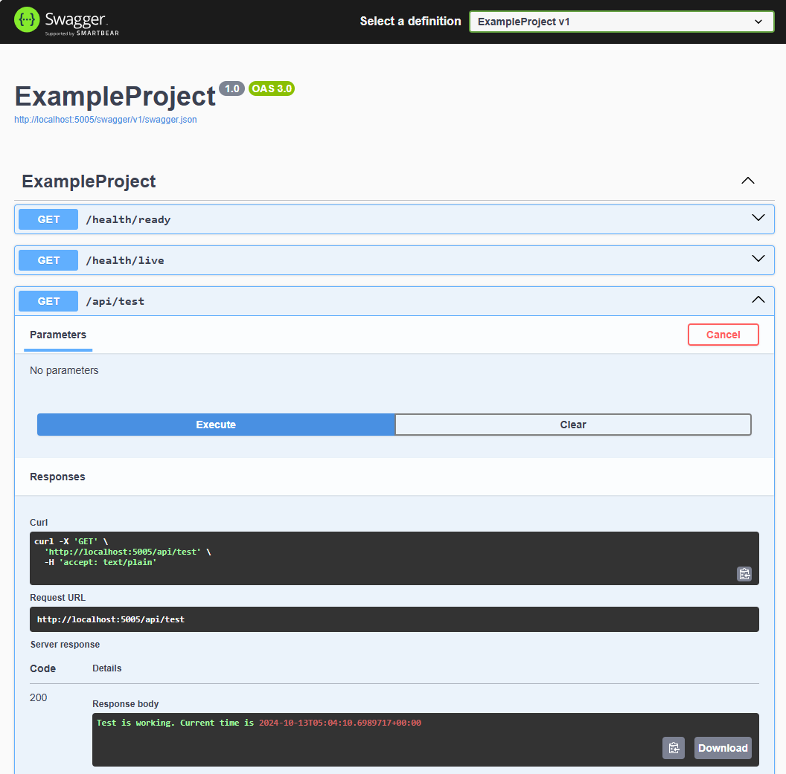

# Develop a listener extension in .NET using Visual Studio 2022

## Prerequisites

This is a continuation of [develop an extension in .NET using Visual Studio 2022 with health and test endpoints](develop-dotnet-extension-using-visual-studio.md).

## Steps

### Add NuGet References for OpenAPI

To simplify testing, add these NuGet packages:
[Microsoft.AspNetCore.OpenApi](https://www.nuget.org/packages/Microsoft.AspNetCore.OpenApi/) and
[Swashbuckle.AspNetCore](https://www.nuget.org/packages/swashbuckle.AspNetCore/)

### Add OpenAPI to Your Code

* **Register OpenAPI services**: In **Program.cs** before `var app = builder.Build();` add the following:

  ```csharp
  builder.Services.AddEndpointsApiExplorer();
  builder.Services.AddSwaggerGen();
  ```

* **Enable SwaggerUI**: just after `var app = builder.Build();` add the following:

  ```csharp
  app.UseSwagger();
  app.UseSwaggerUI();
  ```

* **Annotate Endpoints**: After each endpoint add `.WithOpenApi()`.

  Example:

  ```csharp
  app.MapGet("/health/ready", () => "Healthy and Ready.").WithOpenApi();
  ```

The resulting **Program.cs** looks like this:

```csharp
var builder = WebApplication.CreateBuilder(args);

builder.Services.AddEndpointsApiExplorer();
builder.Services.AddSwaggerGen();

var app = builder.Build();

app.UseSwagger();
app.UseSwaggerUI();

app.MapGet("/health/ready", () => "Healthy and Ready.").WithOpenApi();

app.MapGet("/health/live", () => "Healthy and Live").WithOpenApi();

app.MapGet("/api/test", () => $"Test is working. Current time is {DateTime.Now:O}").WithOpenApi();

app.Run();
```

### Automatically launch the swagger page when starting the extension locally

Open **Properties\launchSettings.json** and replace the `launchUrl` value with the following: `"{Scheme}://{ServiceHost}:{ServicePort}**/swagger**"`.

The **Properties\launchSettings.json** file now looks like this:

```json
{
  "profiles": {
    "Container (Dockerfile)": {
    "commandName": "Docker",
    "launchBrowser": true,
    "launchUrl": "{Scheme}://{ServiceHost}:{ServicePort}/swagger",
    "environmentVariables": {
      "ASPNETCORE_URLS": "http://*:5005"
    },
    "httpPort": 5005
    }
  },
  "$schema": "http://json.schemastore.org/launchsettings.json"
}
```

### Test OpenAPI via Swagger

Build the project, and run it. The browser will open at **/swagger**.

Expand **GET /api/test**, click **Try it out**, then click **Execute** to test.



Stop Debugging.

### Listen to Entity Updates and Log Information

* **Add necessary using statements**: In **Program.cs** add the following at top: `using Microsoft.AspNetCore.Mvc;`.

* **Implement the EntityUpdated listener endpoint**

  This will enable the program to listen to entity updated events and perform any action(s).

  Before `app.Run();` add the following:

  ```csharp
  app.MapPost("/api/listeners/EntityUpdated", (EntityUpdated entityUpdated, [FromServices] ILogger<Program> logger) =>
  {
      logger.LogInformation("Received request to EntityUpdated: {@EntityUpdated}, {@Fields}", entityUpdated, entityUpdated.Fields);
      return Results.NoContent();
  }).WithOpenApi();
  ```

* **Add the types** required for EntityUpdated

  Add the records that will enable strongly typed listener endpoints at the end of the file.

  ```csharp
  internal sealed record EntityUpdated
  {
      /// <summary>
      ///     Gets the unique ID of the entity that was updated.
      /// </summary>
      public required Guid Id { get; init; }

      /// <summary>
      ///     Gets the numeric ID of the entity that was updated.
      /// </summary>
      public required int NumericId { get; init; }

      /// <summary>
      ///     Get the fields that have been updated.
      /// </summary>
      public required FieldModelBase[] Fields { get; init; }

      /// <summary>
      ///     Gets the time when the entity was updated.
      /// </summary>
      public required DateTime Timestamp { get; init; }
  }

  internal sealed record FieldModelBase
  {
      /// <summary>
      ///     Gets the field type ID.
      /// </summary>
      public required string FieldTypeId { get; init; }
  }
  ```

The resulting **Program.cs** looks like this:

```csharp
using Microsoft.AspNetCore.Mvc;

var builder = WebApplication.CreateBuilder(args);

builder.Services.AddEndpointsApiExplorer();
builder.Services.AddSwaggerGen();

var app = builder.Build();

app.UseSwagger();
app.UseSwaggerUI();

app.MapGet("/health/ready", () => "Healthy and Ready.").WithOpenApi();

app.MapGet("/health/live", () => "Healthy and Live").WithOpenApi();

app.MapGet("/api/test", () => $"Test is working. Current time is {DateTime.Now:O}").WithOpenApi();

app.MapPost("/api/listeners/EntityUpdated", (EntityUpdated entityUpdated, [FromServices] ILogger<Program> logger) =>
{
    logger.LogInformation("Received request to EntityUpdated: {@EntityUpdated}, {@Fields}", entityUpdated, entityUpdated.Fields);
    return Results.NoContent();
}).WithOpenApi();

app.Run();

internal sealed record EntityUpdated
{
    /// <summary>
    ///     Gets the unique ID of the entity that was updated.
    /// </summary>
    public required Guid Id { get; init; }

    /// <summary>
    ///     Gets the numeric ID of the entity that was updated.
    /// </summary>
    public required int NumericId { get; init; }

    /// <summary>
    ///     Get the fields that have been updated.
    /// </summary>
    public required FieldModelBase[] Fields { get; init; }

    /// <summary>
    ///     Gets the time when the entity was updated.
    /// </summary>
    public required DateTime Timestamp { get; init; }
}

internal sealed record FieldModelBase
{
    /// <summary>
    ///     Gets the field type ID.
    /// </summary>
    public required string FieldTypeId { get; init; }
}
```

### Run the Container and Call the Endpoint

Build the project, and run it. The browser will open at `/swagger`.

Expand **POST /api/listeners/EntityUpdated**, click **Try it out**, and **Execute**.

View the log output where the container is running.

> **Note:**  
> The log can be seen both in _Output -> Show output from Debug_ and in _Containers -> Solution Containers -> first-example (ExampleProject) -> Logs_


Stop Debugging.

### Push the Docker Image

Go to **Build -> Publish ExampleProject -> Publish**

### Refresh the Docker Image Reference

In the Augmenta UI, navigate to the docker image reference that was previously created.


Click on **Sync Docker Image Reference**. This will fetch the latest image from the container registry and restart the extension that use the image.

### Update an Entity

Use the Portal or inriver REST API to change an entity's field value.

### Check the Logs

In the Augmenta UI, browse to the logs for your extension to view the results.
