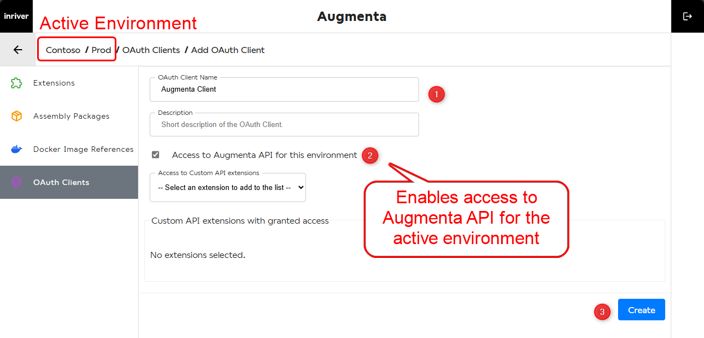
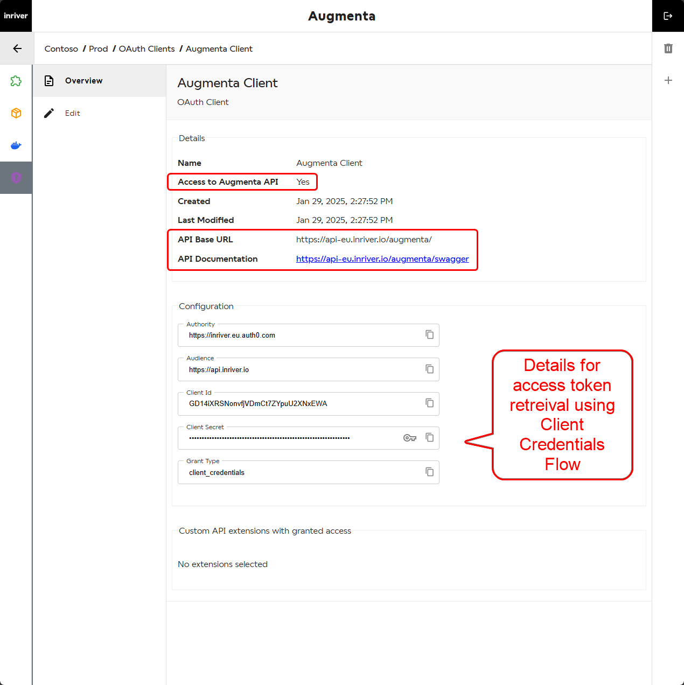

# OAuth Client Setup and Token-Based API Authentication

## Introduction

OAuth clients are a key component for securely accessing the Augmenta API and Custom API extensions. They provide a mechanism to issue a bearer token for authorization and controlled access, enabling integration with Augmenta API in CI/CD pipelines, local development, and other scenarios. For example, you can automate Docker image builds and then use the Augmenta API from your own pipeline to create a Docker Image Reference, then create, test, and start an extension based on that Docker Image Reference, and so on. Everything you can do from the UI, you can do from the API as well. By the end of this tutorial, you will understand how to create and manage OAuth clients, how to get an access token using an OAuth client's configuration, and how to use the token to access the Augmenta API securely.

## Contents

This tutorial covers:

1. How to create and manage OAuth clients using the Augmenta UI.
2. How to use Postman to interact with the Augmenta API.

## OAuth Clients

The Augmenta API requires a mechanism to manage access. OAuth Clients provide this functionality by granting controlled access. Below is the process for creating an OAuth Client, subsequently stored in Auth0, which serves as the identity provider.

An advantage of this setup is that these clients can access both standard Augmenta APIs (for CI/CD or local development) and Custom API extensions, depending on your needs. For Custom API extensions see [.Net](../dotnet/develop-dotnet-custom-api-extension.md) or [Node.js](../node-js/develop-node-js-custom-api-extension.md) documentation.

The Augmenta API Swagger documents all the secured endpoints you can access with the token obtained through this client. The Augmenta API base URL is obtainable from the Swagger link `{base-url}/swagger` and is `https://api-eu.inriver.io/augmenta/` for the EU region and `https://api-us.inriver.io/augmenta/` for the US region.

### Access Token Retrieval and Interacting with the API

OAuth is a standard protocol, meaning you can use any programming language with HTTP support to request a token, given the necessary configuration variables.

For simplicity, we use Postman and JavaScript within Postman’s scripting environment to demonstrate the process [in this example.](../oauth-client/oauth-client-postman-example-augmenta-api.md)

### Summary

#### ✔ CI/CD Integration

- OAuth clients enable seamless integration with pipelines for deploying and managing extensions.

#### ✔ Local Development

- Simplifies local testing and debugging of extensions dependent on the Augmenta API.

#### ✔ Secure Access

- Ensures only authorized clients can interact with the Augmenta API.

#### ✔ Scalability

- Supports complex automation workflows.
