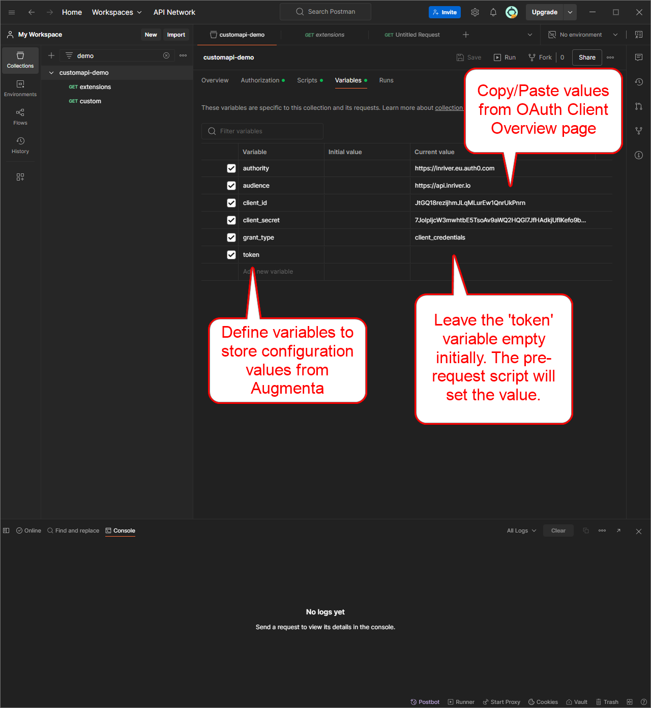
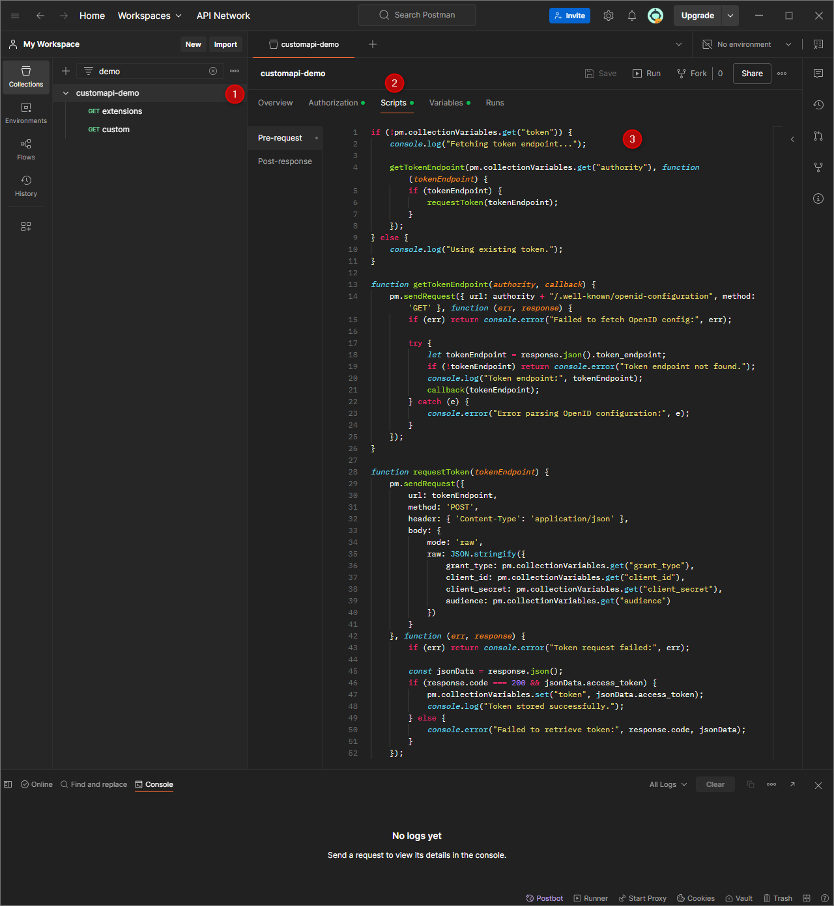
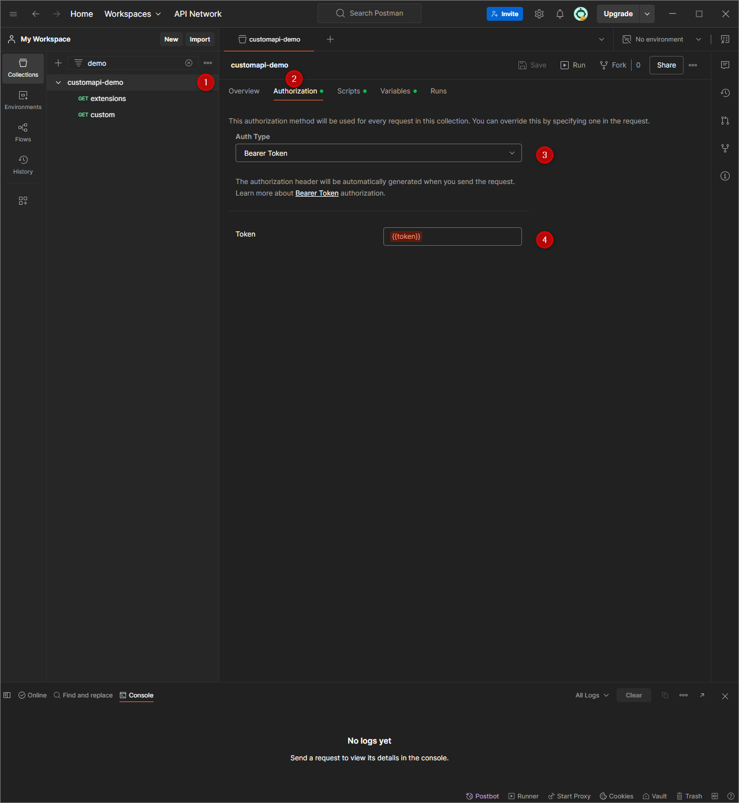
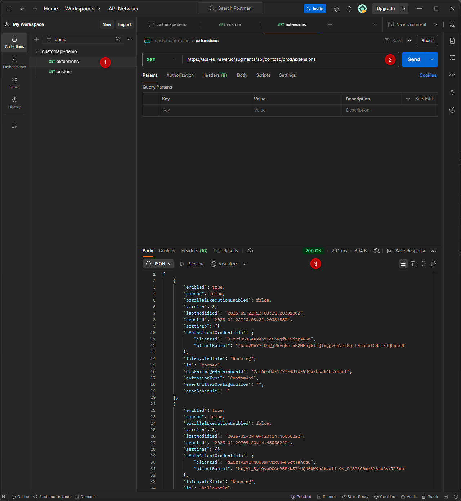
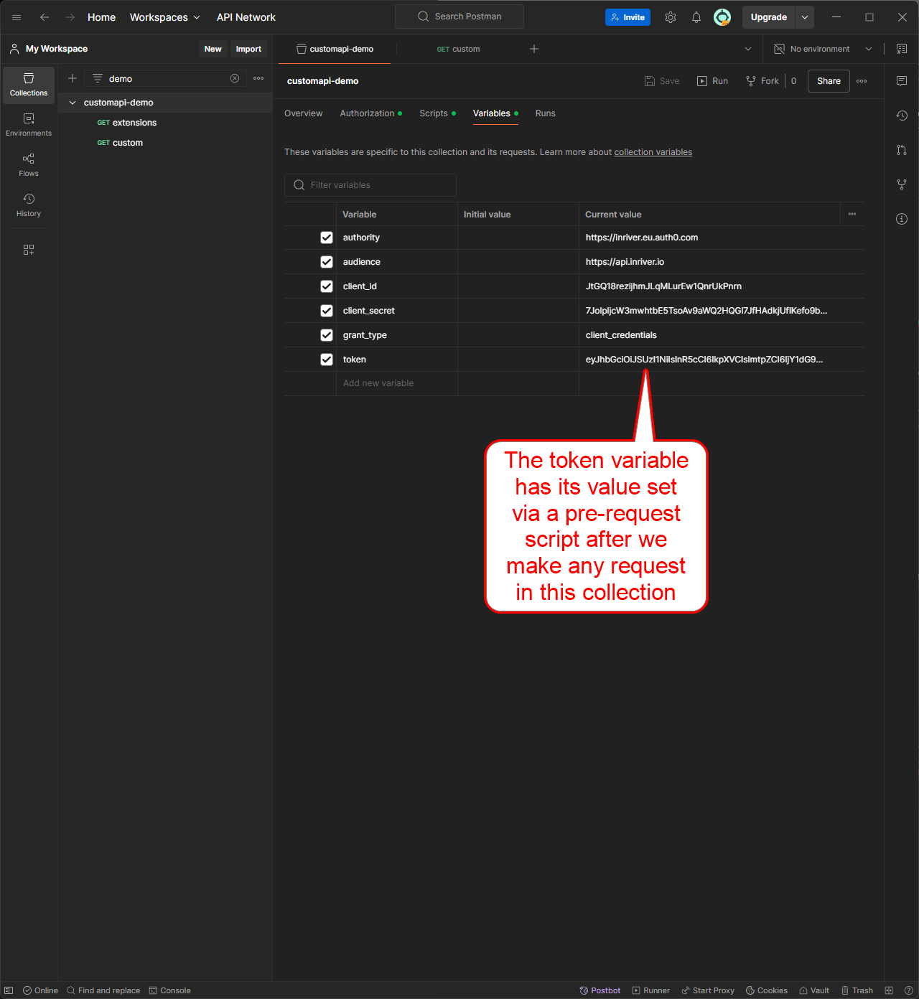

# Using Postman to Authenticate and Interact with the Augmenta API

Now, let’s see this in practice. You can use Postman to authenticate and interact with the Augmenta API.

OAuth is a standard protocol, meaning you can use any programming language with HTTP support to request a token, given the necessary configuration variables. For simplicity, we use Postman and JavaScript within Postman’s scripting environment to demonstrate the process.

Create a new Postman Collection and define variables to store configuration values as shown below.



Next, create a pre-request script. This script runs when a request is triggered in the Postman collection and dynamically sets the `token` value if it is empty.



```javascript
if (!pm.collectionVariables.get("token")) {
    console.log("Fetching token endpoint...");

    getTokenEndpoint(pm.collectionVariables.get("authority"), function (tokenEndpoint) {
        if (tokenEndpoint) {
            requestToken(tokenEndpoint);
        }
    });
} else {
    console.log("Using existing token.");
}

function getTokenEndpoint(authority, callback) {
    pm.sendRequest({ url: authority + "/.well-known/openid-configuration", method: 'GET' }, function (err, response) {
        if (err) return console.error("Failed to fetch OpenID config:", err);
        
        try {
            let tokenEndpoint = response.json().token_endpoint;
            if (!tokenEndpoint) return console.error("Token endpoint not found.");
            console.log("Token endpoint:", tokenEndpoint);
            callback(tokenEndpoint);
        } catch (e) {
            console.error("Error parsing OpenID configuration:", e);
        }
    });
}

function requestToken(tokenEndpoint) {
    pm.sendRequest({
        url: tokenEndpoint,
        method: 'POST',
        header: { 'Content-Type': 'application/json' },
        body: {
            mode: 'raw',
            raw: JSON.stringify({
                grant_type: pm.collectionVariables.get("grant_type"),
                client_id: pm.collectionVariables.get("client_id"),
                client_secret: pm.collectionVariables.get("client_secret"),
                audience: pm.collectionVariables.get("audience")
            })
        }
    }, function (err, response) {
        if (err) return console.error("Token request failed:", err);

        const jsonData = response.json();
        if (response.code === 200 && jsonData.access_token) {
            pm.collectionVariables.set("token", jsonData.access_token);
            console.log("Token stored successfully.");
        } else {
            console.error("Failed to retrieve token:", response.code, jsonData);
        }
    });
}
```

Configure authorization for requests in the collection to use a Bearer Token, referencing the `token` variable.



Create a request and test it. In this case, we will get the list of extensions from the Augmenta API.



After making the first request, the `token` variable will have a stored value.

