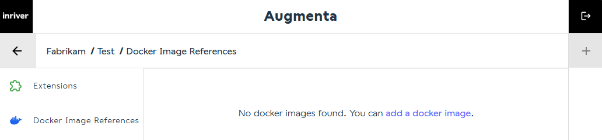
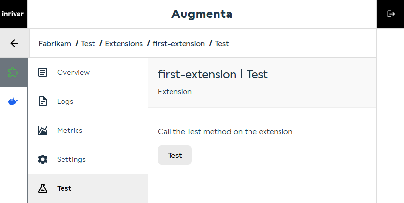

# Run your first extension in Augmenta

## Prerequisites

[You have pushed your image to a container registry](tag-and-push-to-container-registry.md).

## Steps

### Reference the docker image in Augmenta from the container registry

* Go to [Augmenta](https://augmenta-dev1a-euw.inriver.io/) and log in.

* Select a customer

  

* Select an environment.

  

* Navigate to Docker Image References.

  

* Click Add New Docker Image

  

* Create a new Docker Image Reference, and enter the following:
  * **Image Name:** _\<my-username>/\<repository-name>_ e.g. _johndoe1911/my-example_
  * **Image Tag:** `latest`

  and under Docker Registry specify

  * **Url:** _the url to your registry_ (example if you are using docker hub: _registry.hub.docker.com_)
  * **Username:** _your user name to the registry_
  * **Password:** _your password or token to the registry_

  

### Create an extension based on the docker image

* From here click on new extension

  

* Fill in the details:

  * **Unique ID:** `first-extension`
  * **Docker Image Reference:** (pre-filled)
  * **Extension Type:** `EntityListener`
  * **Enabled:** Checked

  

### Test the extension

* Navigate to **Test**

* Click the "Test" button.

The response should be: "Test is working. Current time is..."

Success! Your extension is now running in Augmenta.
