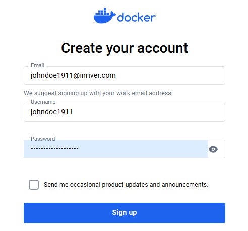
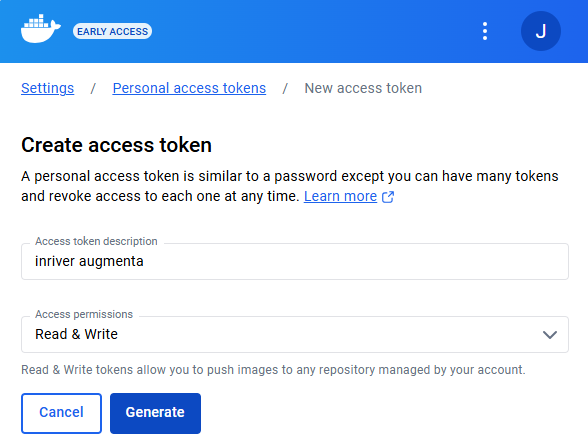

# Setup a container registry in the cloud

## Steps

For new users, Docker Hub is a simple option.

### Sign up to Docker Hub

Follow the first step in [Docker Hub quickstart guide](https://docs.docker.com/docker-hub/quickstart/) to sign up. Skip the other steps.

### Create an access token

Follow the steps [Create an access token.](https://docs.docker.com/security/for-developers/access-tokens/).

* The access token needs **read/write** permissions.

